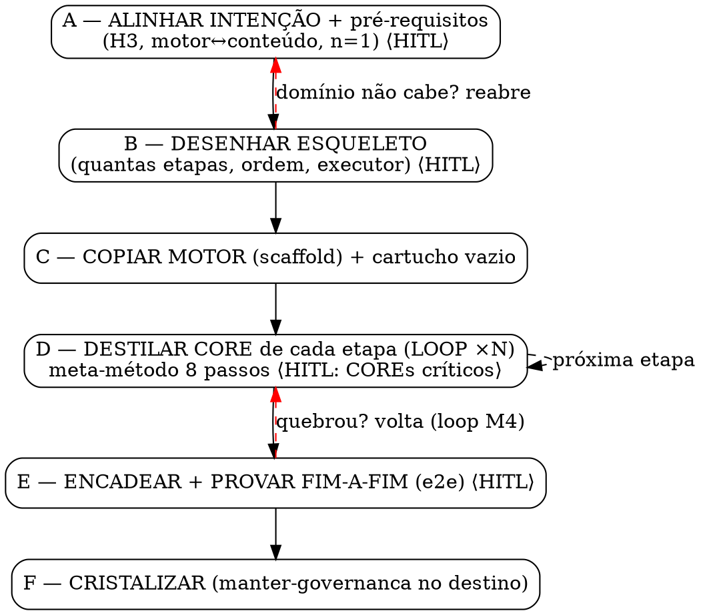

# _WIP — Arquitetura da skill `criar-state-machine` (Fase 4 da A022)

> **Status:** ⚠️ WIP / blueprint pré-escrita. Produzido na Fase 4 (agente `Plan`, read-only, 2026-06-30), consumindo a
> Fase 1 (`_WIP-inventario-invariante-vs-dominio.md`), a Fase 2 (`research/0016`) e a Fase 3
> (`_WIP-meta-metodo-core-do-core.md`). Desenha a forma do artefato que a Fase 6 vai materializar. Herda o n=1
> declarado (M4). A seção "Limites e riscos de UX" é entrada direta da Fase 5 (pré-mortem).

---

## A skill em uma frase

**`criar-state-machine` conduz um operador — que tem um domínio em mente (vídeo, apps, logística) e nenhum contexto
deste projeto — a montar uma state machine DAG-to-Done completa para esse domínio: ela ENTREGA pronto o motor genérico,
o validador, o padrão de briefing, a anatomia de etapa e a governança (tudo 🟢 invariante da Fase 1), e GUIA passo a
passo a destilação do "cartucho" do domínio (etapas, schemas, COREs, catálogos), operacionalizando o meta-método de 8
passos da Fase 3 para destilar o CORE de cada etapa.**

Para quem: o "operador" do `PLANO-DE-ETAPA.md` (humano + agente LLM no loop) transposto para um domínio novo.

---

## Forma escolhida

**Uma única skill (`criar-state-machine/SKILL.md`) + diretório de recursos auxiliares, incluindo o motor `v1/`
embutido como scaffold.** Não é uma skill-maestra que invoca sub-skills.

**Motivo (Decisão 1):** (a) pedido explícito do operador "uma ÚNICA skill completa"; (b) todas as skills do ambiente
são single-file e ponteiras (`manter-governanca`, `upstream-contrib`, `acessar-vps`) — nenhuma compõe sub-skills; (c) a
separação MOTOR↔CONTEÚDO do produto mapeia para **arquivo** (scaffold copiável + guia de destilação), não para skill.
O candidato a sub-skill (`destilar-um-core`) vira **recurso** (`recursos/META-METODO-DESTILAR-CORE.md`) invocado em
loop, porque nunca dispara isolado (destilar um CORE sem uma SM em construção não tem sentido).

---

## O fluxo do operador (6 fases A–F)

Espelha o pipeline do projeto: a Fase A é o análogo da **Etapa 0 (Gate de Intenção, ADR 0032)** e a Fase F o da
**cristalização (Fase 8)**. HITL nos dois pontos canônicos: início (intenção) e marcos-chave (aprovação).

### Fase A — ALINHAR INTENÇÃO + CHECAR PRÉ-REQUISITOS ⟨HITL obrigatório⟩
- **Objetivo:** estabelecer o domínio-alvo e rodar o gate de maturidade ANTES de qualquer trabalho.
- **Saída:** "censo de intenção" (domínio, o que cada execução entrega, veredito de aplicabilidade).
- **HITL:** o operador confirma escopo e LÊ E ACEITA o aviso de maturidade (n=1).
- **Gate de pré-requisitos (3 checagens duras):** (1) tem "motor separado de conteúdo"? (heurística H3 condicional);
  (2) tem etapas com entrega verificável e handoff? (3) aceita o n=1? — fail-fast: evita investir 6 fases num domínio
  onde o método não cabe.

### Fase B — DESENHAR O ESQUELETO (quantas etapas, ordem, executor) ⟨HITL: aprovar o esqueleto⟩
- **Objetivo:** decidir o cartucho em alto nível ANTES de destilar qualquer CORE. (A skill é MAIOR que o meta-método:
  este destila UM core; a Fase B monta a SM inteira.)
- **Saída:** "mapa do pipeline" do domínio (lista ordenada de etapas com {id, nome, executor, entrega, próxima consome}).
- **HITL:** o operador aprova a lista (decisão mais cara de errar). Pré-mortem leve: "este domínio tem mesmo N etapas,
  ou estou copiando as 13 do dev web?".
- **Subagentes:** especialista do domínio (cobaia/consultor) propõe a decomposição; `task-decomposition-expert`
  critica a granularidade.
- **Anti-importação cega:** a skill NÃO sugere as 13 etapas do dev web — ensina a derivar bottom-up (M2), oferecendo a
  anatomia como *menu*, não molde.

### Fase C — COPIAR O MOTOR (scaffold) + INSTANCIAR O CARTUCHO VAZIO
- **Objetivo:** materializar a infra invariante + criar os encaixes vazios.
- **Saída:** motor copiado + `pipeline.config.mjs` esqueleto (1 objeto-etapa vazio por etapa do mapa).
- **HITL:** nenhum (cópia mecânica; revisão por commit). **Subagentes:** nenhum.
- Resolve as F1–F9 como política de scaffold (fábricas genéricas já vêm extraídas — F3/F4/F6/F7).

### Fase D — DESTILAR O CORE DE CADA ETAPA (loop ×N) ⟨HITL: aprovar COREs críticos⟩
- **Objetivo:** o coração. Para cada etapa, rodar o meta-método de 8 passos da Fase 3.
- **Contrato de cada passo (= os 8 passos da Fase 3, de `META-METODO-DESTILAR-CORE.md`):** 1 destilar racional cru (com
  probes do CDM) · 2 batizar · 3 pesquisar o nome · 4 ⭐verificação de ajuste · 5 expandir · 6 escrever (6a anti-fuga +
  6b limite epistêmico) · 7 testar (teste do novato) · 8 cristalizar.
- **HITL:** aprova COREs de etapas críticas (gates, etapas que viram lei); triviais com autonomia (triagem T/M/F do
  `PLANO-DE-ETAPA.md` — só esforço F exige aprovação + evidência mecânica).
- **Subagentes:** `search-specialist` (passo 3), executor cego + adversário (passo 7), `manter-governanca` (passo 8).
- **Heurísticas como lentes:** H1 (transporte de disciplina), H2 (retro-aplicação de lente), H3 (já checada na Fase A).

### Fase E — ENCADEAR E PROVAR FIM-A-FIM (walking skeleton da SM) ⟨HITL: aprovar a SM rodando⟩
- **Objetivo:** provar que a SM roda de ponta a ponta (análogo do e2e, `RF-007`).
- **Saída:** teste de encadeamento real (`init`→`next`→escrever→`advance` por todas as etapas, sem injetar pré-
  condições à mão) verde — o passo 7.4 da Fase 3 promovido a fase própria (roda 1× para a SM toda).
- **Subagentes:** `general-purpose` simulando o operador sem contexto (desenho da Fase 7 do plano).

### Fase F — CRISTALIZAR A SM (governança do novo projeto) ⟨HITL: opcional⟩
- **Objetivo:** casa em ordem no projeto-destino. **Saída:** INDEX/ROADMAP/CHANGELOG/ADRs do novo domínio + declaração
  de maturidade. **Subagentes:** skill `manter-governanca` (composability).

### Dot-graph do fluxo



---

## Estrutura de arquivos da skill

```
~/.claude/skills/criar-state-machine/
├── SKILL.md                          # frontmatter (name/description-gatilho) + 6 fases + dot-graph
│                                     #   + tabela-gatilho + checklists HITL + DoD COLLEAGUE. Corpo enxuto: APONTA.
├── recursos/
│   ├── META-METODO-DESTILAR-CORE.md  # os 8 passos + 3 heurísticas (Fase 3) como roteiro operável (loop da Fase D).
│   ├── MENU-ANATOMIA-DE-ETAPA.md     # as 18 peças (Fase 1) como menu, 🔵 marcadas "destile do seu domínio".
│   ├── PADRAO-BRIEFING.md            # 4 partes + O/E/F/FR + G1–G5 (🟢) — copia.
│   ├── PROBES-CDM.md                 # roteiro de probes do Critical Decision Method (passo 1).
│   ├── CHECKLIST-PRE-REQUISITOS.md   # o gate da Fase A (H3, motor↔conteúdo, aceite do n=1).
│   └── TRIAGEM-ESFORCO.md            # T/M/F + DoD de peça (de PLANO-DE-ETAPA.md) — calibra HITL na Fase D.
└── scaffold-motor/                   # O MOTOR EMBUTIDO — o que a Fase C copia.
    ├── dag.mjs                       # copia EXATA de v1/dag.mjs (🟢 100% copiável).
    ├── pipeline.engine.mjs           # fábricas GENÉRICAS extraídas (camposPresentes, validar*, avaliarEtapa,
    │                                 #   regraEvidenciaObrigatoria, regraCatalogoCoberto, regraVeredictoCoerente [F4],
    │                                 #   regraInconclusivoComMotivo [F6]... SEM catálogos de domínio).
    ├── pipeline.config.template.mjs  # esqueleto: importa as fábricas, PIPELINE=[] com 1 objeto-etapa vazio comentado.
    ├── cores/CORE-TEMPLATE.md        # estrutura interna invariante de um CORE (🟢).
    ├── test/e2e.template.mjs         # teste de encadeamento (Fase E) parametrizado pela lista de etapas.
    └── governanca/                   # sementes de INDEX/ROADMAP/ADR/ABERTO/DESCARTADO (🟢).
```

**Por que o motor vai embutido (Decisão 4):** a Fase 1 conclui que motor + fábricas + briefing + anatomia + governança
são "100% copiáveis" e que "o operador recebe pronto". Embutir dá *portability* (COLLEAGUE) — a skill não depende de
acesso a este repo. É o padrão Golden Path / Backstage Scaffolder (template + gerador viajam juntos).

---

## Copiar vs. destilar (ancorado na Fase 1)

| A skill ENTREGA PRONTO (🟢 — `scaffold-motor/`) | A skill GUIA A DESTILAR (🔵 — Fase D) |
|---|---|
| Motor `dag.mjs` inteiro | — |
| Fábricas genéricas do validador (`camposPresentes`, `validar*`, `avaliarEtapa`, `regraEvidenciaObrigatoria`, `regraCatalogoCoberto`, `regraParaleloDisjunto`, `regraOrdemTopologica`, `regraAncoraRastreavel`, `regraVeredictoGlobalCoerente`, `regraCensoConfrontado`…) | As **instâncias**: catálogo regex, enums, motivos do domínio |
| Fábricas das F1–F9 extraídas de graça (F3 circuito bidirecional, F4 veredito unificado, F6 inconclusivo, F7 rastreabilidade) | O operador só passa os parâmetros do domínio |
| Padrão de briefing (4 partes + O/E/F/FR + G1–G5 + hierarquia + nomenclatura) | A tabela de campos de G1 + o conteúdo de cada parte |
| Anatomia: 18 peças como **menu** (1–10,12–14,16–18 invariantes) | Peças 11 (lentes) e 15 (arquétipo): mecanismo copia, catálogo destila |
| Governança inteira (M1–M4, ADR MADR, ciclo WIP, ABERTO/DESCARTADO) | — |
| Estrutura interna de um CORE (`CORE-TEMPLATE.md`) + placeholders de infra | O **conteúdo** de cada CORE (vocabulário, regras, schema do domínio) |
| — | As N etapas concretas (quantas, ordem, executor) |
| — | O `schemaEstrutural` de cada etapa |
| — | Os catálogos (`CATALOGO_GATES`, `_LENTES`, `_WCAG`, `_ESTADOS_UI`, `MOTIVOS_INCONCLUSIVO`) |

**Frase-resumo:** o operador recebe **motor + validador + padrão de briefing + anatomia + governança prontos, e destila
do zero apenas o cartucho** — o que é, quem faz, como se verifica, e o que cada etapa produz no seu domínio.

---

## DoD da skill (5 propriedades COLLEAGUE.SKILL)

- **Portable** — roda sem acesso a este repo (motor/fábricas/meta-método viajam embutidos). *Critério:* operador em
  outra máquina, só com a skill, monta uma SM sem clonar este projeto.
- **Inspectable** — o operador vê *por que* cada fase existe. *Critério:* o SKILL.md separa critério/porquê (tutorial-
  do-porquê do Golden Path) do mecânico/como; o meta-método cita a âncora de cada passo (caso real OU fonte).
- **Composable** — chama outras skills do ambiente. *Critério:* Fase F invoca `manter-governanca`; Fase D pode invocar
  `deep-research`/`search-specialist`. Não duplica governança.
- **Correctable** — declara onde está errada e como consertar. *Critério:* Fase A força aceite do n=1; todo CORE marca
  o não-validável como "⚠️ PROVISÓRIO"; a SM nasce com `ABERTO.md` das premissas frágeis.
- **Governable** — cada decisão rastreável e versionada. *Critério:* Fase F produz ADRs MADR; cada CORE recebe descrição
  canônica indexável; o tracker registra evidência + veredito por peça.

---

## Decisões desta fase

1. **Forma:** uma skill única + recursos + motor embutido, NÃO skill-maestra. *Motivo:* pedido do operador; skills do
   ambiente são single-file; separação motor↔conteúdo mapeia para arquivo, não skill.
2. **Fluxo de 6 fases (A–F)** com HITL no início e em cada marco, espelhando o pipeline. *Motivo:* os dois pontos HITL
   já institucionalizados (Etapa 0 + cristalização); triagem T/M/F define quando exigir aprovação.
3. **Contrato dos passos internos:** a Fase D É os 8 passos da Fase 3; B/C/E são os passos de "montagem da SM" que a
   Fase 3 não cobre. *Motivo:* a Fase 3 declara-se sobre UMA etapa; a skill precisa do "antes" (quantas etapas) e do
   "depois" (provar o encadeamento).
4. **Motor `v1/` como scaffold embutido.** *Motivo:* Fase 1 prova 100% copiável; embutir dá portability; segue Golden
   Path/Scaffolder; extrai as fábricas F3/F4/F6/F7 de graça.
5. **Pré-requisitos + maturidade na Fase A como gate duro.** *Motivo:* H3 é condicional (a skill DEVE checar a separação
   motor↔conteúdo); a declaração de maturidade é obrigatória; fail-fast.

---

## Limites e riscos de UX (entrada para a Fase 5 — pré-mortem)

1. **A Fase B é onde o operador mais erra — e a skill pode induzir o erro.** Mostrar as 13 etapas do dev web como
   "exemplo" gera ancoragem. A skill precisa ENSINAR a derivar bottom-up sem dar molde a copiar.
2. **O passo 4 (verificação de ajuste) é o mais arriscado e difícil de operar.** Nunca exercitado; um operador sem
   contexto pode respondê-lo superficialmente (viés de confirmação com cara de rigor).
3. **Premissas escondidas do dev web vazam nas fábricas "genéricas"** (regex PT-BR em F5; `CATALOGO_GATES` 100% TS/JS).
   O operador de vídeo encontra uma fábrica que "deveria ser genérica" mas pede um conceito de software.
4. **"Todo domínio tem ambiente vivo / executor que sonda" é falso.** O grau de certeza (peça 2) deriva de uma
   ontologia de executores (Explore lê código, fiscal toca rede) que pode não ter análogo em criação (vídeo, texto).
5. **O loop da Fase D é longo (8 passos × N etapas)** — risco de fadiga e "atalho" (COREs rasos). A triagem T/M/F mitiga;
   o tracker precisa estar muito visível.
6. **A skill herda o n=1 e só pode declará-lo, não consertá-lo.** Risco de o operador achar que usa método validado. A
   Fase 7 (replicação real) é o único teste verdadeiro.
7. **Composability assume agentes/skills que podem não existir** no ambiente do operador. A skill deve degradar
   graciosamente (passo roda inline se o subagente faltar) e nomear subagentes como preferenciais, não obrigatórios.